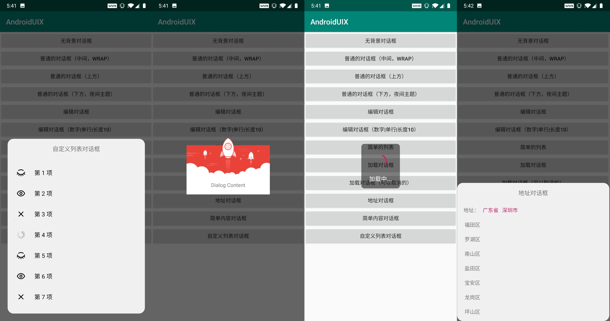
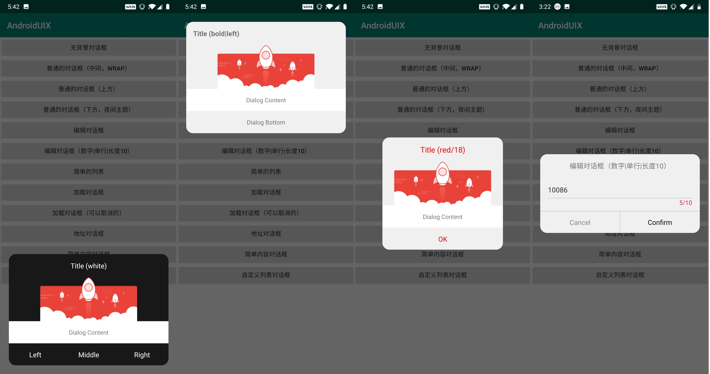
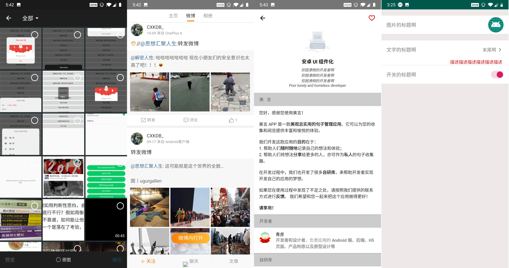
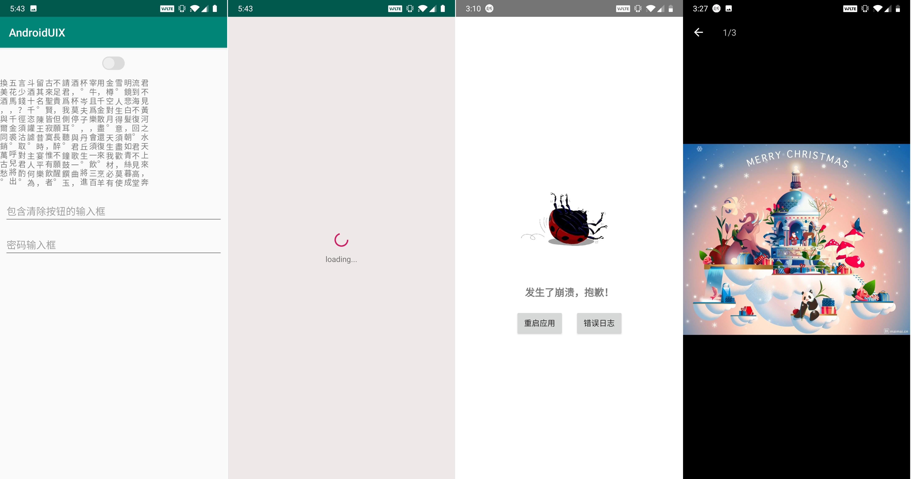

# Android-UIX：Android UI 解决方案


[](https://www.codacy.com/manual/Shouheng88/Android-uix?utm_source=github.com&amp;utm_medium=referral&amp;utm_content=Shouheng88/Android-uix&amp;utm_campaign=Badge_Grade)
[](https://travis-ci.org/Shouheng88/Android-uix)

## 1、关于项目

作为整个 MVVM 架构的一部分，我们开发这个库的目的就在于提供一套通用的 UI 控件和 UI 页面。比如，关于页面、用户信息设置页面、通用对话框等。当你在开发的时候可以通过引用这个库来避免大量的开发工作。我们已经将该仓库上传到了远程的 jcenter 中，您可以直接通过在 gradle 中引用该库来使用它。

## 2、在项目中引用

在项目中接入我们的库是非常简单的。首先，在项目的 Gradle 中加入 jcenter 仓库：

```gradle
repositories {
    jcenter()
}
```

然后在你的项目依赖中直接引用我们的库即可：

```gradle
implementation 'me.shouheng.ui:uix-core:latest-version'
```

然后你需要在自定义 Application 中初始化类库。这里主要的目的也是初始化一个全局的 Context，所以不用担心这里会因为耗时太长而影响用户体验：

```kotlin
class SampleApp: Application() {

    override fun onCreate() {
        super.onCreate()
        UIX.init(this)
    }
}
```

## 3、在项目中使用 Android UIX

根据项目目前所包含的 UI 控件，功能如下：

首先，对于 RecyclerView 的 Adapter 封装，我们直接引用了 [BRBAH](https://github.com/CymChad/BaseRecyclerViewAdapterHelper)，因为正如它声称的那样，确实可以为我们节省 60% 到 70% 的代码。而且项目中的其他的页面或控件的开发也是基于该库来完成的。

### 3.1 对话框

在我们的项目中没有使用 Android 原生的对话框，而是自定义了一套对话框。对话框整体基于构建者模式进行设计，为你提供了强大的可自定义的功能。比如：

1. **从页面上方、中间或者下方弹出的对话框**；
2. **夜间和日间主题**支持，同时支持自定义对话框背景；
3. 支持**预定义背景和透明背景**的对话框等；
4. 支持 **iOS 和 Android 风格**的进度加载样式；
5. 默认提供了一些对话框的实现，比如**地址选择，进度加载**等；
6. **优雅封装**，及其他强大特性……

在我们的对话框的设计中，将对话框分成了标题、内容和底部三个部分。你需要分别实现 `IDialogTitle`、`IDialogContent` 和 `IDialogFooter` 三个接口当中的任意几个。当然，我们还为您提供了一些默认的实现。比如，简单的内容展示、文本编辑、地址选择和列表对话框等等。不论从自定义还是默认提供的功能，它都足够强大。

下面是一个对话框的一般的用例：

```kotlin
BeautyDialog.Builder()
        .setDialogStyle(STYLE_WRAP)
        .setDialogTitle(SimpleTitle.Builder()
                .setTitle("Title (red/18)")
                .setTitleSize(18f)
                .setTitleColor(Color.RED)
                .build())
        .setDialogContent(SampleContent())
        .setDialogBottom(SimpleFooter.Builder()
                .setBottomStyle(BUTTON_RIGHT_ONLY)
                .setRightText("OK")
                .setRightTextColor(Color.RED)
                .setOnClickListener(object : SimpleFooter.OnClickListener {
                    override fun onClick(dialog: BeautyDialog, buttonPos: Int, dialogTitle: IDialogTitle?, dialogContent: IDialogContent?) {
                        dialog.dismiss()
                    }
                }).build())
        .build().show(supportFragmentManager, "normal")
```

对话框示例，进一步了解对话框的内容可以通过我们的 sample 项目了解：



对话框 1 示例，从左到右依次是：复杂列表对话框、无背景对话框、普通加载对话框以及地址选择对话框。



对话框 2 示例，从左到右依次是：夜间背景的底部弹出对话框、日间背景的顶部弹出对话框、普通的中间弹出对话框以及普通的编辑对话框（支持自定义文字长度、输入类型和长度实时展示等等）。

### 3.2 UI 页面

- 图片选择：对于图片选择，我们直接基于知乎开源的 [Matisse](https://github.com/Shouheng88/Matisse) 进行了封装，在其原有的功能之上提供了夜间和白天两种主题。
- 图片浏览页面
- 网页浏览页面：基于 [AgentWeb](https://github.com/Justson/AgentWeb) 做了简单的封装，您可以通过该库来对 WebView 进行自定义；
- 设置页面：支持文案展示、图标类型的设置条目、条目底部增加备注文案、Switch 类型的条目、支持自定义各种背景颜色和文字颜色等等；
- 关于页面：丰富的自定义样式，支持多种类型的条目列表等
- 崩溃页面：可以获取崩溃异常栈、重启 APP 入口页面等



其他相关的 ui 库，从左到右依次是：图片选择框架、网页浏览框架、关于页面以及设置页面



其他相关的 ui 库，从左到右依次是：竖着展示的文字控件、Switch 按钮、可以点击尾部消除的输入控件、密码输入控件、列表为空以及列表进度加载控件、崩溃页面

### 3.3 RecyclerView

对于 RecyclerView，在我们的项目当中我们直接使用了开源库 [BRVAH](https://github.com/CymChad/BaseRecyclerViewAdapterHelper) 作为开发的基础库。同时，您也可以在引用了我们的库之后在自己的程序中使用该框架进行开发。该库对 RecyclerView 进行了优雅的封装，可见减少 60%-70% 的代码量，因此我们也推荐您使用该库进行开发。

除了引用的 RecyclerView 的适配器相关的库，我们还提供了一些其他的封装：

- RV 装饰器：提供了列表条目边缘填充的装饰器 SpaceItemDecoration 以及可以按住指定的控件进行拖拽的 DragSortRecycler 等；
- RV 为空的页面的控件封装 EmptySupportRecyclerView，自定义数据源监听等；

### 其他必选的控件库

- 圆形图片
- Switch 按钮
- Glide 图片圆角变换
- 正方形的 FrameLayout 和 LinearLayout 布局
- 防止连续点击的 NoDoubleClickListener
- ViewPager 的指示器
- 倒计时控件
- 具备清空功能的文本输入框
- 可以查看输入内容的密码输入框
- 垂直的文字展示控件
- 正则表达式校验的输入框

## 4、更新日志

- 1.1.7
    - 对话框底部按钮点击状态调整
    - 加载按钮背景调整
    - 新增普通按钮
    - 崩溃页面启动方式改为构建者模式
    - 配置框架的方式调整
    - 一般列表增加文字对齐方式
    - 设置列表增加长文本类型选项
    - 网页浏览页面的更多按钮可以选
- 1.1.5
    - WebviewFragment 支持自定义，支持更多按钮
    - 关于页面的列表项支持末尾追加自定义控件
    - EmptySupportRecyclerView 的判断列表为空的 bug 修复
    - 增加带加载状态的按钮
- 1.1.4
    - 设置列表页增加说明性质的文字，可以自定义背景等
    - Crash 崩溃捕捉页面
- 1.1.3 稳定版本发布

## 5、关于作者

你可以通过访问下面的链接来获取作者的信息：

1. Github: https://github.com/Shouheng88
2. 掘金：https://juejin.im/user/585555e11b69e6006c907a2a
3. CSDN：https://blog.csdn.net/github_35186068

## License

```
Copyright (c) 2019 WngShhng.

Licensed under the Apache License, Version 2.0 (the "License");
you may not use this file except in compliance with the License.
You may obtain a copy of the License at

   http://www.apache.org/licenses/LICENSE-2.0

Unless required by applicable law or agreed to in writing, software
distributed under the License is distributed on an "AS IS" BASIS,
WITHOUT WARRANTIES OR CONDITIONS OF ANY KIND, either express or implied.
See the License for the specific language governing permissions and
limitations under the License.
```

