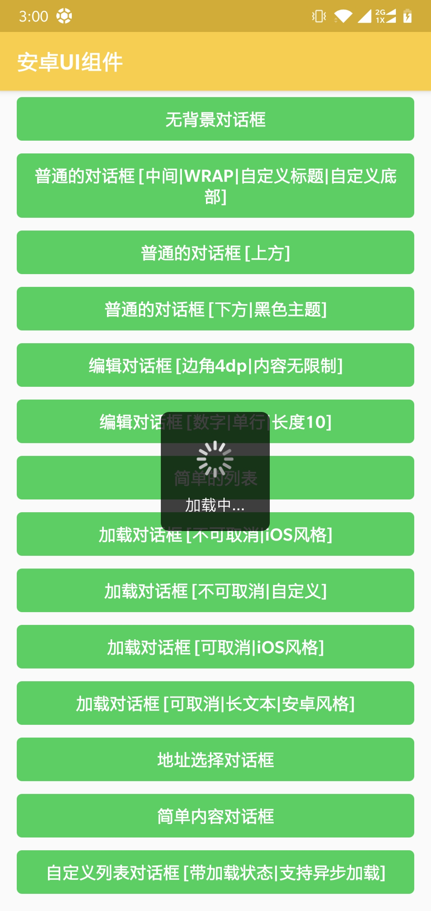

<h1 align="center">Android-UIX：Android UI 解决方案</h1>

<p align="center">
  <a href="http://www.apache.org/licenses/LICENSE-2.0">
    
  </a>
  <a href="https://bintray.com/beta/#/easymark/Android/uix-core?tab=overview">
    
  </a>
  <a href="https://www.codacy.com/manual/Shouheng88/Android-uix?utm_source=github.com&amp;utm_medium=referral&amp;utm_content=Shouheng88/Android-uix&amp;utm_campaign=Badge_Grade">
    
  </a>
  <a href="https://travis-ci.org/Shouheng88/Android-uix">
    
  </a>
    <a href="https://developer.android.com/about/versions/android-4.2.html">
    
  </a>
   <a href="https://github.com/Shouheng88">
    
  </a>
  <a target="_blank" href="https://shang.qq.com/wpa/qunwpa?idkey=2711a5fa2e3ecfbaae34bd2cf2c98a5b25dd7d5cc56a3928abee84ae7a984253">
    
  </a>
</P>

## 1、关于项目

该库旨在提供一套 Android 端通用的 UI 控件和 UI 页面，比如关于页面、用户信息设置页面、通用对话框、输入控件等，来帮助开发者避免大量的重复性开发工作，从而提升软件开发端效率。我们已经将该仓库上传到了远程的 jCenter 中，您可以直接通过在 Gradle 中引用该库来使用它。

## 2、在项目中使用

### 2.1 添加工程依赖

我们已经将该库上传到了 jCenter. 要使用该库，你首先需要做的是在项目的 Gradle 中加入 jcenter 仓库：

```gradle
repositories {
    jcenter()
}
```

然后，在你的项目依赖中直接引用我们的库：

```gradle
implementation 'me.shouheng.ui:uix-core:latest-version'
```

### 2.2 项目初始化

你需要在自定义 Application 中初始化类库。这里主要的目的也是初始化一个全局的 Context，所以不用担心这里会因为耗时太长而影响用户体验：

```kotlin
class SampleApp: Application() {

    override fun onCreate() {
        super.onCreate()
        UIX.init(this)
    }
}
```

## 3、项目功能一览

现在的项目结构被划分为三个部分：通用模块、控件模块以及页面组件模块。下面是该库提供的主要功能列表，最新最全的功能可以直接参考示例代码、示例工程或者源代码。

### 3.1 控件部分

**1. 丰富的对话框**

我们的项目中没有使用原生的对话框，而是自定义了一套对话框。对话框整体基于构建者模式进行设计，为你提供了丰富且强大的可自定义的功能。比如：

1. 对话框弹出位置：从页面上方、中间或者下方；
2. 主题支持：夜间和日间主题支持，同时支持自定义对话框背景；
3. 支持预定义背景和透明背景的对话框等；
4. 支持 iOS 和 Android 风格的进度加载样式；
5. 默认提供了一些对话框的实现，比如地址选择、进度加载、提示、编辑框、普通的文案展示等；
6. 优雅封装，高度可定制，及其他强大特性。

在我们的对话框的设计中，将对话框分成了标题、内容和底部三个部分。你需要分别实现 `IDialogTitle`、`IDialogContent` 和 `IDialogFooter` 三个接口当中的任意几个。当然，我们还为您提供了一些默认的实现。比如，简单的内容展示、文本编辑、地址选择和列表对话框等等。不论从自定义还是默认提供的实现，它都足够强大。

对话框示例，进一步了解对话框的内容可以通过我们的 Sample 项目了解：

<div style="display:flex;" id="target">


</div>

普通对话框示例，从左到右依次是：无背景对话框、中间弹出的普通图文对话框、上方弹出的普通图文对话框、底部弹出的夜间主题普通图文对话框、普通列表对话框以及普通内容展示对话框。

<div style="display:flex;" id="target">




</div>

对话框 2 示例，从左到右依次是：普通输入框、限制性输入框、自定义加载列表、地址选择、不可撤销加载提示、不可撤销状态提示、可撤销加载提示、可撤销长文案提示。

**2. 丰富的 UI 控件**

1. Switch 按钮：支持各种风格并且支持高度自定义；
2. 正方形的 FrameLayout 和 LinearLayout 布局；
3. 流式布局控件 Flowlayout；
4. ViewPager 的指示器；
5. 倒计时控件 CountDownView；
6. 垂直的文字展示控件 VerticalTextView；
7. 正则表达式校验的输入框，可以自定义尾部按钮等；
8. 具备清空功能的文本输入框 ClearEditText；
9. 强大的自定义按钮，加载状态按钮：NormalButton；
10. 其它控件，具体查考示例项目和源码。

### 3.2 页面组件

<div style="display:flex" id="target">


</div>

- 图片选择：我们直接基于知乎开源的图片选择控件 [Matisse](https://github.com/Shouheng88/Matisse) 进行了封装，在原有的功能之上提供了夜间和白天两种主题；
- 图片浏览页面；
- Matisse 与 Glide 组合相关的组件；
- Glide 图片加载框架边角自定义组件；
- 设置页面：支持文案展示、图标类型的设置条目、条目底部增加备注文案、Switch 类型的条目、支持自定义各种背景颜色和文字颜色，以及加载状态等等；
- 崩溃页面：可以获取崩溃异常栈、重启 APP 入口页面等；
- 关于页面：丰富的自定义样式，支持多种类型的条目列表等；
- 网页浏览页面 WebviewFragment；

## 4、关于

### 4.1 关于作者

你可以通过访问下面的链接来获取作者的信息：

1. Twitter: https://twitter.com/shouheng_wang
2. Github: https://github.com/Shouheng88
3. 掘金：https://juejin.im/user/585555e11b69e6006c907a2a
4. 简书: https://www.jianshu.com/u/e1ad842673e2

### 4.2 更新日志

[更新日志](CHANGELOG.md)

## 5、捐赠项目

我们致力于为广大开发者和个人开发者提供快速开发应用的解决方案。您可以通过下面的渠道来支持我们的项目，

<div style="display:flex;" id="target">


</div>

## License

```
Copyright (c) 2019 WngShhng.

Licensed under the Apache License, Version 2.0 (the "License");
you may not use this file except in compliance with the License.
You may obtain a copy of the License at

   http://www.apache.org/licenses/LICENSE-2.0

Unless required by applicable law or agreed to in writing, software
distributed under the License is distributed on an "AS IS" BASIS,
WITHOUT WARRANTIES OR CONDITIONS OF ANY KIND, either express or implied.
See the License for the specific language governing permissions and
limitations under the License.
```

